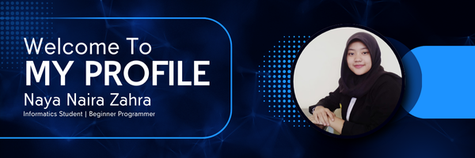

# Hi, im Naya Naira Zahra 👋

<!--
**NayaNaira/NayaNaira** is a ✨ _special_ ✨ repository because its `README.md` (this file) appears on your GitHub profile.

Here are some ideas to get you started:

- 🔭 I’m currently working on ...
- 🌱 I’m currently learning ...
- 👯 I’m looking to collaborate on ...
- 🤔 I’m looking for help with ...
- 💬 Ask me about ...
- 📫 How to reach me: ...
- 😄 Pronouns: ...
- ⚡ Fun fact: ...
-->
🔹 I am an Informatics student at UNSAP Sumedang, currently building my foundation in computer science and technology.  
🔹 I am actively learning the basics of programming, web development, and game development to strengthen my technical skills.  
🔹 I have a growing interest in web technologies, data, and software development, and I enjoy exploring how technology can be used to solve real-world problems.

## 🛠 Skills (In Progress)

💻 **Programming:** Python, Java  
👩‍💻 **Web Development:** HTML, CSS, Basic JavaScript  
🎮 **Game Development:** C#, GDScript  
🕹️ **Game Engines:** Unity, Godot  
🧰 **Tools:** VS Code, Git & GitHub

