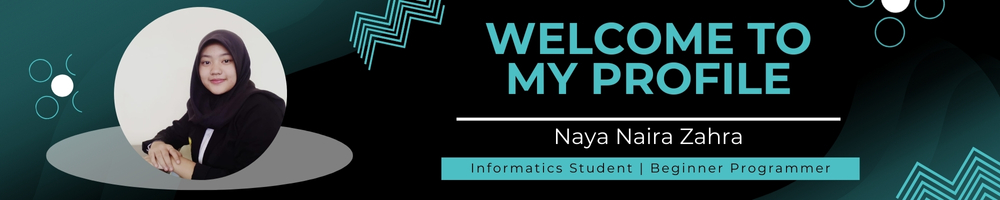

  

<h1 align="center">Hi there, I'm Naya Naira Zahra! 👋</h1>

  

---

### 💫 About Me
🔹 **Education:** Informatics Student at **UNSAP Sumedang**.  
🔹 **Focus:** Building foundations in computer science and modern tech.  
🔹 **Interests:** Exploring how technology can solve real-world problems.  
🔹 **Current Goal:** Strengthening technical skills in Web & Game Development.

---

### 🛠️ Tech Stack & Skills

#### 🌐 Web Development

#### 🎮 Game Development

#### 💻 Programming & Tools

---

### 📊 GitHub Activity

# 📊 GitHub Stats:
 
 

---

### 📫 Let's Connect!

---

  <i>"Mimpi besar dimulai dari langkah kecil."</i> 
  ⭐️ From <b>NayaNaira</b>

